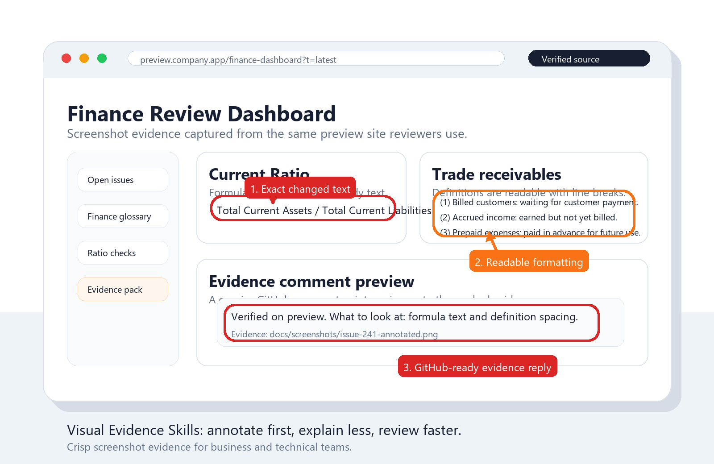

# Visual Evidence Skills

Cross-harness Agent Skills and CLI helpers for screenshot-based visual evidence.

Visual Evidence helps AI agents capture the right source, mark the exact area with clear callouts, and share proof that business and technical reviewers can understand at a glance.

Project site: https://kokoabassplayer.github.io/visual-evidence-skills/

## Install

Recommended one-command install from GitHub today:

```bash
npx github:Kokoabassplayer/visual-evidence-skills
```

After npm publishing, the package command will be:

```bash
npx @visual-evidence/install@latest
```

The installer detects supported harnesses and installs the best available adapter. If it finds more than one harness, it installs all detected targets by default.

Supported targets:

| Target | Install behavior |
| --- | --- |
| Claude Code | Installs standalone user skills under `~/.claude/skills` (`visual-evidence-annotations`, `github-visual-evidence-comments`). |
| Codex | Installs Agent Skills under `~/.codex/skills`. |
| OpenClaw | Installs Agent Skills under `~/.openclaw/skills`. |
| Gemini CLI | Installs skills plus a Gemini context file under `~/.gemini/visual-evidence`. |
| Generic Agent Skills | Installs plain skills under `~/.agents/skills`. |

Useful options:

```bash
npx github:Kokoabassplayer/visual-evidence-skills --target all
npx github:Kokoabassplayer/visual-evidence-skills --target claude-code
npx github:Kokoabassplayer/visual-evidence-skills --target codex
npx github:Kokoabassplayer/visual-evidence-skills --target openclaw
npx github:Kokoabassplayer/visual-evidence-skills --target gemini-cli
npx github:Kokoabassplayer/visual-evidence-skills --target generic
npx github:Kokoabassplayer/visual-evidence-skills --dry-run
```

Fallback wrappers when working from a cloned repo:

```bash
./installers/install.sh --target all
```

```powershell
.\installers\install.ps1 --target all
```

## Use

Universal visual evidence:

```text
Use visual-evidence to capture this page and mark the field that is wrong.
```

GitHub evidence comment:

```text
Use visual-evidence to prepare a GitHub issue or PR comment with annotated screenshot evidence.
```

Specific skill names remain available for harnesses that expose Agent Skills directly:

```text
Use $visual-evidence-annotations to capture the preview page and mark the formula text.
Use $github-visual-evidence-comments to draft the PR comment with the annotated evidence.
```

## CLI Helper

The skills include a bundled pure Node.js helper. It can annotate SVG, PNG, and JPEG inputs into an annotated SVG without external dependencies.

```bash
node skills/visual-evidence-annotations/scripts/visual-evidence.mjs annotate screenshot.png --box "120,80,360,120" --label "Check here"
node skills/visual-evidence-annotations/scripts/visual-evidence.mjs annotate screenshot.svg --circle "240,160,48" --arrow "160,120,220,150" --label "Wrong value"
node skills/github-visual-evidence-comments/scripts/visual-evidence.mjs github-comment --source "https://preview.example" --image "https://example.test/evidence.png" --validation "Preview passed." --look "The marked area shows the requested change."
```

## Visual Guide

This is the kind of result the skills are meant to produce: one screenshot, clear context, and precise visual callouts around the evidence.



| Visual element | Use it for | Good result |
| --- | --- | --- |
| Circle | Small controls, numbers, icons, or short labels | The target is obvious without covering it. |
| Box | Text blocks, table rows, cards, formulas, or wide UI regions | The reviewer can still read the marked content. |
| Arrow or pin | Showing relationship, movement, or a hard-to-find target | The marker points to the exact evidence, not just the general area. |
| Short label | When the mark alone is ambiguous | The label says what the screenshot proves in one sentence. |

## Repository Layout

```text
skills/
  visual-evidence-annotations/
  github-visual-evidence-comments/

packages/
  cli/
  installer/

adapters/
  claude-code/
  codex/
  openclaw/
  gemini-cli/
  generic/

installers/
  install.sh
  install.ps1
```

The original top-level skill folders remain for backward compatibility.

## Boundaries

The universal visual skill does not include GitHub, PR, ticket, approval, or commit workflow steps. The GitHub companion skill adds only the evidence-comment workflow. It still does not close issues, merge PRs, change labels, or add resolving keywords unless the user separately asks for that.

## Sponsor This Work

If this workflow helps your team review faster, you can support the project through GitHub Sponsors:

https://github.com/sponsors/Kokoabassplayer

Sponsorship is optional support for the open-source project. It helps fund better examples, documentation, automation scripts, and GitHub comment templates. It does not create a support SLA, custom-work guarantee, or paid-service obligation unless we separately agree on that.

## License

MIT